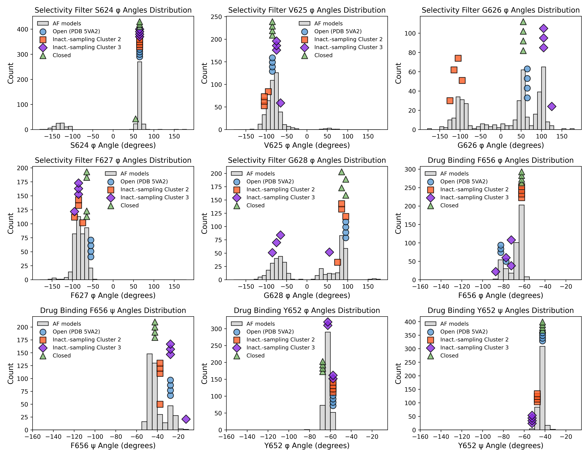
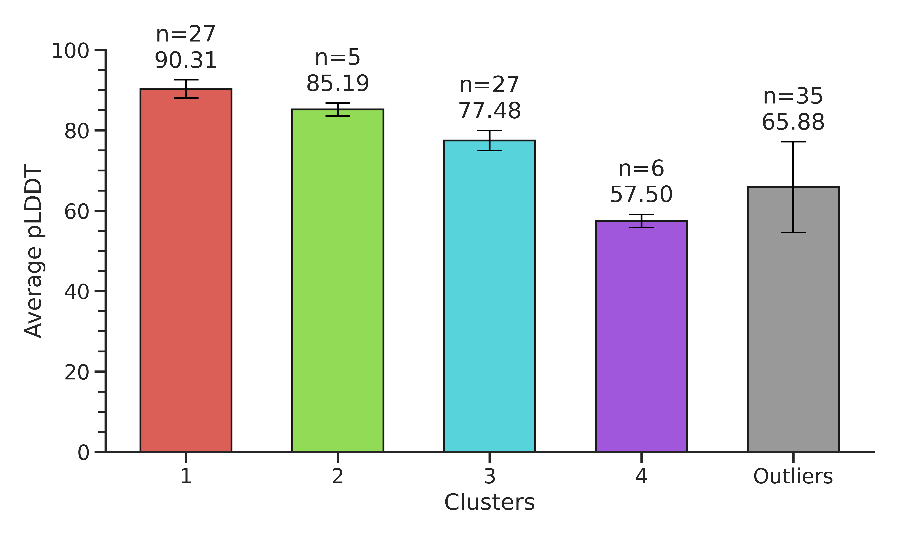

# AlphaFold_Analysis
Scripts for analyzing AlphaFold predicted models

For questions, please email khoango@ucdavis.edu

Please cite: https://doi.org/10.7554/eLife.104901.1

______________________________________________________
# plot_dihedral_angles_AF_models.py

## Overview

`plot_dihedral_angles_AF_models.py` is designed to extract dihedral angles (φ or ψ) from AlphaFold-predicted PDB models. 
Optionally, it can also incorporate reference PDB models for comparison.
The script processes a user-specified set of residues and generates histogram plots showing the distribution of the chosen dihedral angle.

## Command-Line Arguments and Their Utility

- **-p, --predicted_pattern** (REQUIRED)  
  **Description:** Glob pattern to match predicted PDB files.  
  **Utility:** Ensures the script processes the correct set of AlphaFold models.  
  **Example:** `alphafold_models/*rank*.pdb`

- **--residues**  
  **Description:** Comma-separated list of residue numbers to analyze.  
  **Utility:** Focuses the analysis on residues of interest (e.g., specific functional sites).  
  **Example:** `624,625,626,627,628`

- **--angle_type**  
  **Description:** Choose which dihedral angle to plot; options are "phi" (default) or "psi".  
  **Utility:** Allows you to focus on either the backbone φ angles or ψ angles, which provide different structural insights.  
  **Example:** `phi`

- **-f, --fig_prefix**  
  **Description:** Prefix for output figure filenames.  
  **Utility:** Helps organize and identify the generated plots.  
  **Example:** `dihedral_angles`

- **-r, --reference_files** (OPTIONAL)  
  **Description:** Comma-separated list of reference PDB files.  
  **Utility:** Useful for overlaying experimental or known reference structures with the predicted models.  
  **Example:** `o.pdb,i.pdb,ic3.pdb,co.pdb`

- **--ref_colors** (OPTIONAL)  
  **Description:** Comma-separated key:value pairs to specify colors for each reference file.  
  **Utility:** Enhances visual differentiation of reference datasets in the plots.  
  **Example:** `o.pdb:#5B9BD5,i.pdb:#FC5C24,co.pdb:#7CBB6C,ic3.pdb:blueviolet`

- **--ref_marker_styles** (OPTIONAL)  
  **Description:** Comma-separated key:value pairs to specify marker styles for each reference file.  
  **Utility:** Further customizes plot appearance to clearly distinguish each reference model.  
  **Example:** `o.pdb:o,i.pdb:s,co.pdb:^,ic3.pdb:D`

- **--ref_file_labels** (OPTIONAL)  
  **Description:** Comma-separated key:value pairs for labels corresponding to each reference file.  
  **Utility:** Provides meaningful legend entries for overlaying reference models.  
  **Example:** `o.pdb:"Open (PDB 5VA2)",i.pdb:"Cluster 2",ic3.pdb:"Cluster 3",co.pdb:"Closed"`

- **-c, --chains**  
  **Description:** Comma-separated list of chain IDs to process.  
  **Utility:** Targets specific chains in multi-chain PDB files.  
  **Example:** `A,B,C,D`

- **-po, --predicted_offset**  
  **Description:** Offset to apply to residue numbering in predicted models.  
  **Utility:** Corrects for numbering differences between predicted models and reference structures.  
  **Example:** `397`

- **--grid_layout** (OPTIONAL)  
  **Description:** Two integers defining the number of rows and columns for a combined plot figure.  
  **Utility:** Combines all residue plots into one figure for side-by-side comparison; any unused subplot is cleared.  
  **Example:** `2 3`

- **-ds, --dot_size**, **-dec, --dot_edge_color**, **-dpt, --dot_proximity_threshold**  (OPTIONAL)
  **Description:** Adjust the size, edge color, and spacing of dots overlaid on the histograms (used for reference models).  
  **Utility:** Fine-tunes the visual overlay to avoid clutter and improve readability.

## Usage Scenarios and Examples

### 1. Basic Analysis of Predicted Models

If you want to analyze the φ angles for residues 624,625,626,627, and 628 from your predicted models, run:

`python plot_dihedral_angles_AF_models.py -p alphafold_models/*rank*.pdb --residues 624,625,626,627,628 --angle_type phi`
This command uses the required predicted file pattern and a specific set of residues. It generates separate plots (one per residue) showing the φ angle distributions, which is ideal for initial explorations of conformational variability.

### 2. Comparative Analysis with Reference Models
To compare predicted models with experimental or reference structures, use:

`python plot_dihedral_angles_AF_models.py -p alphafold_models/*rank*.pdb --residues 624,625,626,627,628 --angle_type phi -r o.pdb,i.pdb,ic3.pdb,co.pdb --ref_colors o.pdb:#5B9BD5,i.pdb:#FC5C24,co.pdb:#7CBB6C,ic3.pdb:blueviolet --ref_marker_styles o.pdb:o,i.pdb:s,co.pdb:^,ic3.pdb:D --ref_file_labels o.pdb:"Open (PDB 5VA2)",i.pdb:"Cluster 2",ic3.pdb:"Cluster 3",co.pdb:"Closed" --predicted_offset 397`

This scenario overlays reference model data onto the predicted models’ plots. Custom colors, marker styles, and labels help distinguish between different reference datasets, which is particularly useful when validating predictions or highlighting structural differences. Residue numbers from alphaFold predicted models will start at 1, so an offset of "397" in this case is added to increment residue numbers in the predicted models by 397 to match with canonical numbering in the reference models. The numbering in "--residues" will be processed after this offset is applied.

### 3. Combined Plot in a Grid Layout

To create a single combined figure with all plots arranged in a grid (e.g., 2 rows × 3 columns):

`python plot_dihedral_angles_AF_models.py -p alphafold_models/*rank*.pdb --residues 624,625,626,627,628 --angle_type phi --grid_layout 2 3`

This command produces one combined image where each subplot corresponds to one residue’s φ angle distribution. The grid layout facilitates easy visual comparison across multiple residues in a consolidated view, which is ideal for presentation or publication purposes.

### 4. Analysis of Psi Angles for Specific Residues

For instance, if your interest lies in analyzing the ψ angles for residues 100, 101, and 102:

`python plot_dihedral_angles_AF_models.py -p alphafold_models/*rank*.pdb --residues 100,101,102 --angle_type psi`

This command focuses on the ψ angles of a different set of residues. Running the script with --angle_type psi switches the analysis to the ψ dihedral angle, allowing you to probe backbone conformations from a different perspective.

______________________________________________________
# clustering_pdb_AF_models.py

## Overview

`clustering_pdb_AF_models.py` is a command-line tool that clusters AlphaFold-predicted PDB models based on the structural similarity of user-specified residues. The script calculates the all-atom RMSD between each pair of models—averaging the values over specified chains—and then clusters the models using the DBSCAN algorithm. It outputs detailed cluster information and generates a bar plot showing the average pLDDT (prediction confidence score stored in the B-factor) for each cluster.

## Command-Line Arguments and Their Utility

- **`-p, --pdb_pattern`**  
  **Description:** Glob pattern to match predicted PDB files.  
  **Utility:** Specifies the input set of PDB models to be clustered.  
  **Example:** `alphafold_models/*rank*.pdb`

- **`--residues`**  
  **Description:** Comma-separated list of residue numbers to use for clustering.  
  **Utility:** Focuses the RMSD calculation on functionally or structurally relevant regions.  
  **Example:** `227,228,229,230,231`

- **`-c, --chains`**  
  **Description:** Comma-separated list of chain IDs to process.  
  **Utility:** Specifies which chains to include in the RMSD calculation. This is especially useful for homooligomeric complexes (e.g., homotetramers).  
  **Example:** `A,B,C,D`

- **`--rmsd_threshold`**  
  **Description:** RMSD threshold for clustering (eps value for DBSCAN).  
  **Utility:** Determines the maximum RMSD for models to be considered similar; tuning this parameter adjusts the cluster granularity.  
  **Example:** `0.35`

- **`--min_cluster_size`**  
  **Description:** Minimum number of models for a cluster.  
  **Utility:** Clusters with fewer members than this threshold are merged into an outlier cluster to reduce noise.  
  **Example:** `3`

- **`--results_file`**  
  **Description:** Filename for saving/loading clustering results in JSON format.  
  **Utility:** Allows reuse of previously computed clustering results to avoid recalculation.  
  **Example:** `pdb_cluster_results.json`

- **`--overwrite`**  
  **Description:** Flag to force overwriting the saved clustering results file.  
  **Utility:** Useful when you want to re-run the clustering with updated parameters even if prior results exist.  
  **Example:** Include `--overwrite` in the command line.

## Usage Scenarios and Examples

### 1. Basic Clustering of Predicted Models

Cluster predicted models using the default set of residues.

`python clustering_pdb_AF_models.py -p alphafold_models/*rank*.pdb --residues 227,228,229,230,231`

This command computes pairwise RMSD values over residues 227–231 for all predicted models and clusters them using the default RMSD threshold. It’s ideal for an initial exploration of structural variability in a specific region of the protein.

### 2. Clustering Homotetramer Models

When clustering homotetramer models, specify all four chains so that the RMSD is averaged over chains A, B, C, and D.

`python clustering_pdb_AF_models.py -p alphafold_models/*rank*.pdb --residues 227,228,229,230,231 -c A,B,C,D`

For homotetrameric proteins, each model contains four identical chains. By specifying -c A,B,C,D, the script computes the RMSD for each chain and averages them, providing a more robust measure of overall structural similarity for the entire oligomeric assembly.

### 3. Adjusting Clustering Granularity

Fine-tune the clustering by adjusting the RMSD threshold and setting a higher minimum cluster size.

`python clustering_pdb_AF_models.py -p alphafold_models/*rank*.pdb --residues 227,228,229,230,231 --rmsd_threshold 0.30 --min_cluster_size 5`

Lowering the RMSD threshold to 0.30 makes the clustering more stringent, resulting in clusters with higher internal similarity. Increasing the minimum cluster size to 5 filters out smaller, potentially insignificant clusters by merging them into an outlier group.

### 4. Using Saved Clustering Results

If you have already computed clustering results, load them from a JSON file to save time on re-computation.

`python clustering_pdb_AF_models.py -p alphafold_models/*rank*.pdb --residues 227,228,229,230,231 --results_file pdb_cluster_results.json`

Loading previously saved results avoids the computationally intensive step of recalculating all pairwise RMSD values, which is particularly beneficial when working with a large number of models.

